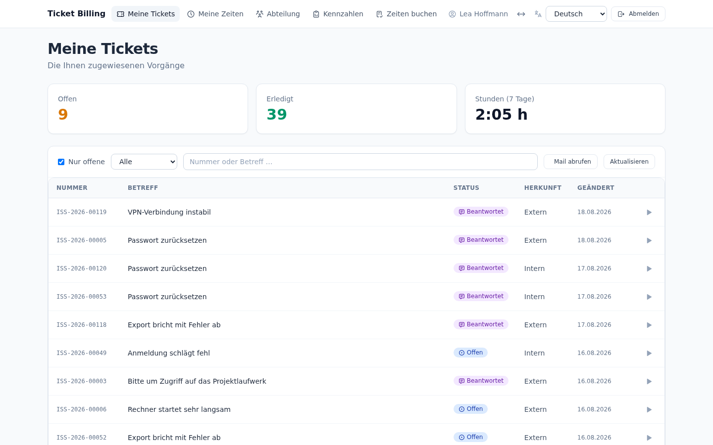
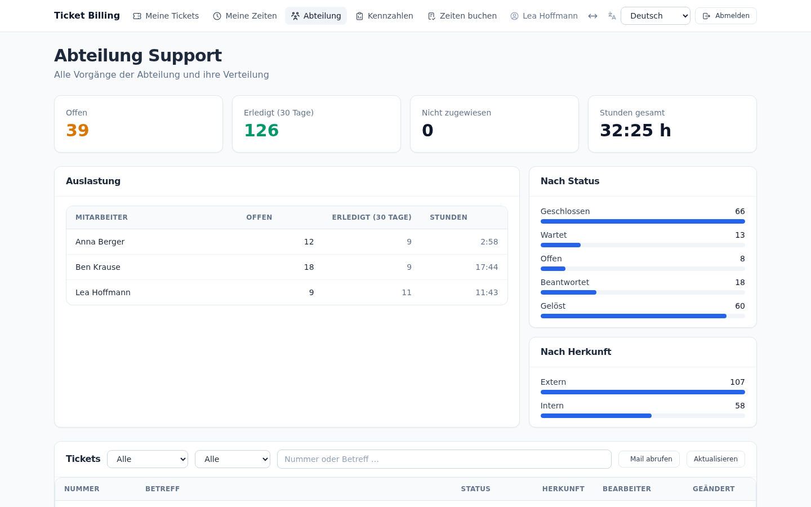
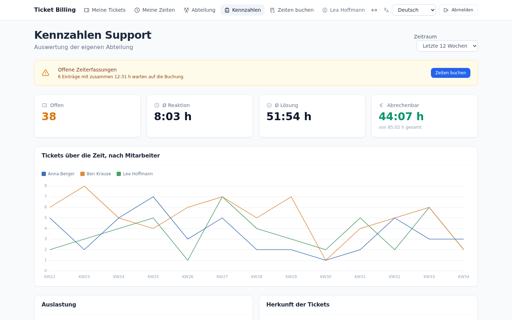
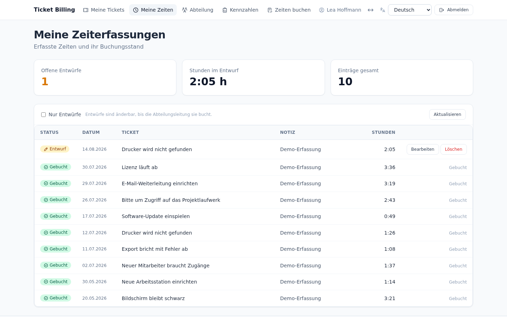
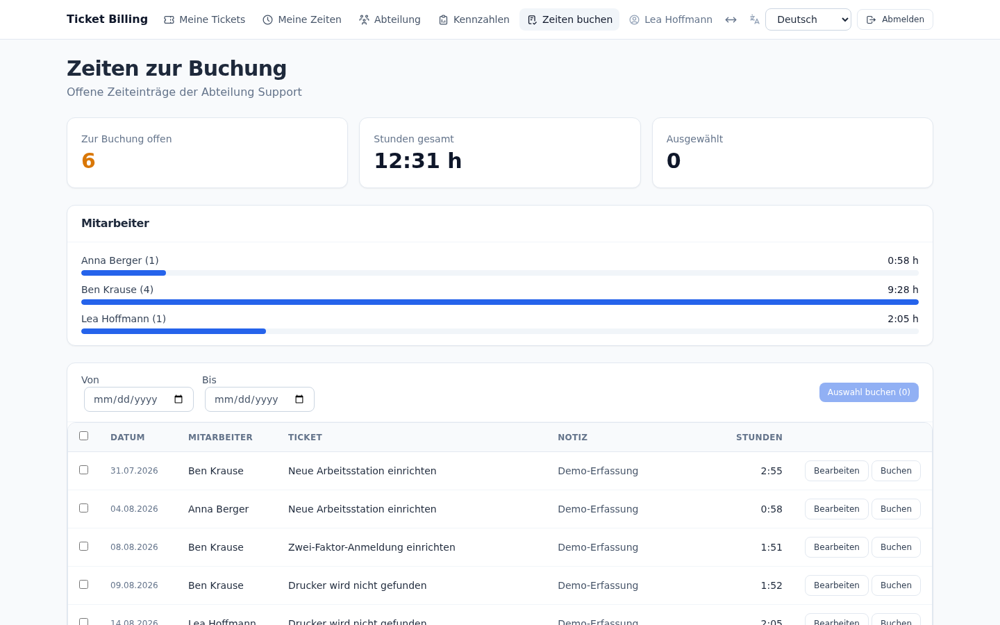
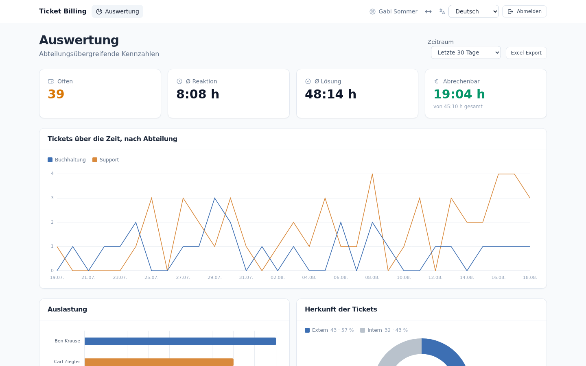
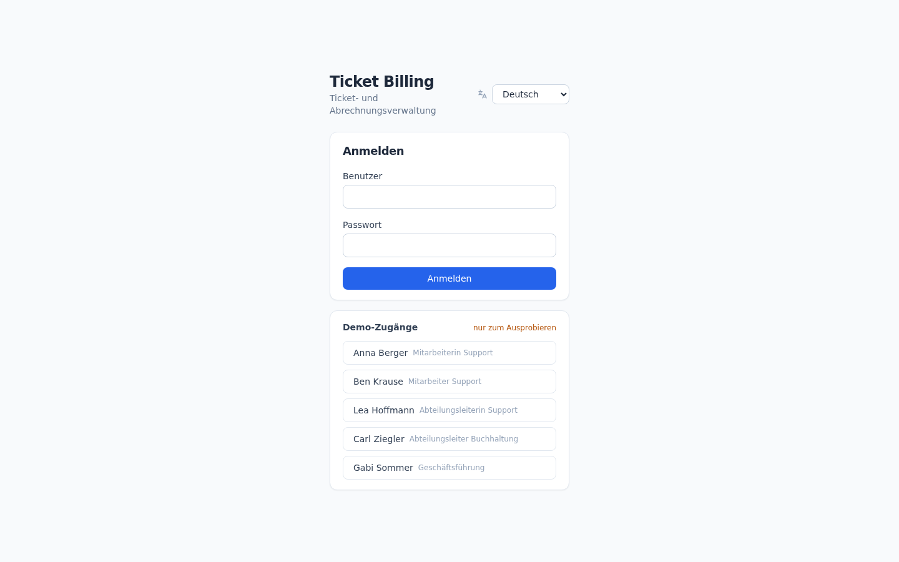

# Ticket Billing

*Deutsch · [English](README.en.md)*

Frappe-App für Ticket- und Abrechnungsverwaltung, aufbauend auf **ERPNext 16**
und **Frappe Framework 16**.

Tickets entstehen aus E-Mails externer Kunden oder als interne Anfragen
zwischen Abteilungen. Der Zugriff ist nach Abteilung und Rolle getrennt, neue
Tickets werden automatisch zugewiesen, erfasste Zeiten laufen über ein
Vier-Augen-Prinzip in die ERPNext-Rechnungsstellung.

Das dazugehörige Docker-Setup liegt in einem eigenen Repo:
[`ticket_billing_docker`](https://github.com/saschafo/ticket_billing_docker).

---

## Inhalt

* [Datenmodell](#datenmodell)
* [Rollen und Rechte](#rollen-und-rechte)
* [Automatische Zuweisung](#automatische-zuweisung)
* [E-Mail](#e-mail)
* [Zeiterfassung](#zeiterfassung)
* [Vier-Augen-Prinzip](#vier-augen-prinzip)
* [Realtime](#realtime)
* [Oberfläche](#oberfläche)
* [Mehrsprachigkeit](#mehrsprachigkeit)
* [Kennzahlen](#kennzahlen)
* [Abrechnung](#abrechnung)
* [Demo-Daten](#demo-daten)
* [Sicherheitshinweise](#sicherheitshinweise)
* [Grenzen des Entwurfs](#grenzen-des-entwurfs)
* [Einrichtung, die zur Anlage gehört](#einrichtung-die-zur-anlage-gehört)
* [Lizenz](#lizenz)

---

## Datenmodell

Es entstehen keine eigenen Ticket-Doctypes — die App erweitert ERPNext:

| Doctype | Feld | Zweck |
|---|---|---|
| `Issue` | `tb_department` | zuständige Abteilung (Pflicht) |
| `Issue` | `tb_origin` | `Internal` / `External` |
| `Issue` | `tb_assigned_employee` | zugewiesener Mitarbeiter |
| `Issue` | `tb_first_response_on` | Zeitpunkt der ersten Reaktion |
| `Issue` | `tb_resolved_on` | Zeitpunkt der Erledigung |
| `Issue` | `customer` (ERPNext) | nur bei externer Herkunft zulässig |
| `Timesheet Detail` | `tb_issue` | verknüpft den Zeiteintrag mit dem Ticket |
| `Email Account` | `tb_department` | ein Postfach je Abteilung |

Eigene Doctypes: `Ticket Billing Settings` (Einstellungen), `Ticket Timer`
(ein laufender Timer) und `Ticket Billing Demo Record` (Nachverfolgung der
Demo-Daten).

Die Felder legt [`setup.py`](ticket_billing/setup.py) bei `after_install` und
bei jedem `after_migrate` idempotent an — nicht als Fixture. Fixtures auf
fremden Doctypes brechen, sobald ERPNext dort etwas ändert.

## Rollen und Rechte

| Rolle | Sicht |
|---|---|
| `Mitarbeiter` | die ihm zugewiesenen Tickets, dazu die selbst angelegten |
| `Abteilungsleiter` | alle Tickets seiner Abteilung, Umverteilung, Team-Auswertung, Zeitfreigabe |
| `Geschäftsführung` | abteilungsübergreifend **lesend**, kein Schreibrecht |

Abgesichert wird auf drei Ebenen, alle im Backend:

1. **DocPerms** als Obergrenze (was eine Rolle überhaupt darf).
2. **User Permission auf `Department`** — wird aus `Employee.department`
   gespiegelt ([`doc_events/employee.py`](ticket_billing/doc_events/employee.py))
   und von Frappe automatisch auf jede Abfrage angewandt.
3. **`permission_query_conditions` und `has_permission`**
   ([`permissions.py`](ticket_billing/permissions.py)) für die zeilenweise
   Einschränkung. Das greift für Desk, Report, `frappe.get_list` **und** REST —
   nicht nur für die Oberfläche.

Jeder Whitelisted-Endpunkt prüft zusätzlich selbst. Die Auswertungen umgehen
die Zeilenfilter bewusst (eine Kennzahl muss zählen, was man einzeln nicht
sehen darf) — deshalb steht dort vor jeder Abfrage eine ausdrückliche Prüfung.

> **Wichtig:** `tb_assigned_employee` trägt `ignore_user_permissions`. ERPNext
> legt zu jedem Employee eine User Permission auf sich selbst an; ohne dieses
> Flag sähe ein Abteilungsleiter nur die Tickets, die auf ihn selbst laufen.

## Automatische Zuweisung

Beim Anlegen eines Tickets — auch bei einem aus dem Posteingang — greift
`after_insert`. Die Regel ist austauschbar:

```
assignment/
├── base.py                    Schnittstelle (Candidate, AssignmentStrategy)
├── registry.py                Verzeichnis, @register
├── strategies/
│   ├── __init__.py            importiert die Regeln
│   └── by_workload.py         Startregel: wenigste offene Tickets
└── __init__.py                Rahmen: Kandidaten → Regel → anwenden
```

Eine neue Regel (Round-Robin, kategoriebasiert, manuelle Bestätigung):

```python
# assignment/strategies/round_robin.py
from ticket_billing.assignment.base import AssignmentStrategy
from ticket_billing.assignment.registry import register

@register
class RoundRobinStrategy(AssignmentStrategy):
    key = "round_robin"
    label = "Reihum"

    def select(self, issue, candidates):
        ...  # None heißt: nicht zuweisen, der Leiter entscheidet
```

Dazu eine Importzeile in `strategies/__init__.py`, und in den Einstellungen
`assignment_strategy` auf `round_robin` setzen. Am übrigen Code ändert sich
nichts.

Fehler in der Zuweisung werden geloggt, nicht geworfen: Ein unzugewiesenes
Ticket ist sichtbar und nachträglich verteilbar, eine am Pflichtfeld
gescheiterte E-Mail nicht.

Systemabsender (`mailer-daemon@`, `postmaster@`, `noreply@` …) werden
übersprungen — ein Rückläufer ist keine Arbeit für jemanden.

---

## E-Mail

Der vollständige Weg: Eine Mail an ein Abteilungspostfach wird zum Ticket,
der Bearbeiter antwortet aus dem Ticket heraus, die Antwort des Kunden hängt
sich an denselben Vorgang.

### Eingang: das Postfach bestimmt die Abteilung

Je Abteilung ein `Email Account` mit `tb_department`. Beim IMAP-Abruf muss
`append_to = Issue` am **Ordner** stehen (`IMAP Folder`), nicht am Konto —
bei aktiviertem IMAP wertet Frappe nur die Ordnerzeile aus.

Die Abteilung wird in dieser Reihenfolge bestimmt
([`doc_events/issue.py`](ticket_billing/doc_events/issue.py)):

1. **Abteilung des empfangenden Postfachs** — hat Vorrang, auch wenn im Feld
   schon etwas steht.
2. was am Ticket steht (bei Anlage in der Oberfläche),
3. die Standardabteilung aus den Einstellungen,
4. sonst ein Abbruch mit verständlicher Meldung.

> **Warum das Postfach vorgeht:** Frappe belegt Verweisfelder aus den
> Benutzerrechten vor. Wer genau eine Abteilung sehen darf, bekommt sie beim
> Anlegen automatisch eingetragen. Ruft ein Mitarbeiter die Post ab, entstünde
> das Ticket dadurch in **seiner** Abteilung statt in der des Postfachs — eine
> Mail an die Buchhaltung landete beim Support. Eine Vorbelegung ist keine
> Entscheidung.

Damit das Postfach überhaupt am Ticket ankommt, setzt die App den Property
Setter `Issue.recipient_account_field = email_account` (siehe unten).

### Herkunft: intern oder extern

`tb_origin` entscheidet mehr als eine Beschriftung: Zeiten auf **externen**
Tickets gehen als abrechenbar in die Rechnungsstellung, interne nicht.

Als intern gilt ein Absender, wenn eine der drei Bedingungen zutrifft:

* die Adresse ist eines der eigenen Postfächer,
* sie gehört einem **aktiven Mitarbeiter** (`Employee.user_id`),
* sie liegt auf derselben Domain wie eines der eigenen Postfächer.

Bewusst `Employee` und nicht `User`: Ein Kunde mit Portalzugang ist auch ein
Benutzer, gehört aber nicht ins Haus.

> Die Domain-Regel setzt voraus, dass unter den eigenen Domains niemand von
> außen schreibt. Wer Kunden auf einer eigenen Domain hat, muss das anders
> lösen.

### Verlauf und Antworten

Der Text einer eingegangenen Mail steht **nicht** in `Issue.description`,
sondern in verknüpften `Communication`-Sätzen. Die Detailansicht zeigt sie im
Reiter *Verlauf* mit Absender, Zeitpunkt und Anhängen — als Text, nicht als
HTML (fremde Mails werden nicht ungeprüft gerendert).

Antworten geht direkt aus dem Ticket: Empfänger sind vorbelegt (Absender der
letzten eingegangenen Nachricht, sonst der ursprüngliche Absender), Absender
ist das Postfach der Abteilung. Die Antwort trägt `in_reply_to`, wodurch die
Rückantwort des Kunden wieder an **demselben Ticket** landet. Der Status
wechselt auf *Replied*.

**Antworten gehen sofort raus.** Frappe legt ausgehende Mail sonst nur in die
Warteschlange, die der Zeitplan alle vier Minuten leert — gemessen 11 bis 244
Sekunden. Der Endpunkt stößt die zugehörigen Einträge gezielt an, als
Hintergrundjob (der SMTP-Griff darf die Oberfläche nicht anhalten). Schlägt
das fehl, holt der reguläre Sammellauf sie nach; die Mail geht nicht verloren.

In der Ticketliste trägt eine Zeile den Hinweis **Neue Antwort**, sobald die
jüngste Nachricht von außen kam — aber nur bei einer Nachricht *nach* der
Eröffnung. Sonst trüge ihn jedes neue Ticket, und ein Hinweis, den alle
tragen, sagt nichts.

### Rückläufer

Ein Zustellfehler kommt als Mail vom Mailsystem zurück. Ohne Zutun legt
Frappe dafür ein eigenes Ticket an und die Zuweisung schiebt es jemandem in
die Liste — eine Störungsmeldung sähe aus wie eine Kundenanfrage.

[`mail_filter.py`](ticket_billing/mail_filter.py) erkennt Systemabsender am
Teil vor dem `@` und hängt die Nachricht an das Ticket, dessen Antwort
zurückkam. Den Ticketnamen liefert der Abmeldelink in der zitierten
Originalmail, also ein systemseitiger Anker. Zusätzlich muss die Adresse des
Ausstellers im Rückläufer vorkommen — sonst ging die gescheiterte Mail an
jemand anderen (etwa an eine interne Benachrichtigung) und gehört nicht in
den Kundenverlauf. Lässt sich nichts zuordnen, wird das Ticket geschlossen
statt gelöscht.

### Abruf

Der Zeitplan holt alle zehn Minuten (`0/10 * * * *`), gemessen 74 bis 482
Sekunden bis zur Ankunft. Wer nicht warten will, nutzt **Mail abrufen** in
den Listenansichten: ein Abruf dauert rund 0,25 Sekunden je Postfach und
meldet sofort, was dazugekommen ist.

Eine **gemeinsame** Sperre von zehn Sekunden bremst das — nicht eine je
Benutzer: Belastet wird der Mailserver, und gleichzeitige Klicks sollen
daraus keine Vervielfachung machen. Die Rechteprüfung sitzt im Endpunkt; ein
ausgeblendeter Knopf ist keine Sperre.

### Voraussetzungen für den Versand

Ausgehende Mail wird von großen Anbietern abgelehnt, wenn die Absenderdomain
sich nicht ausweisen kann. Gmail verlangt seit 2024 **SPF oder DKIM**:

```
550-5.7.26 Your email has been blocked because the sender is unauthenticated.
550-5.7.26 Gmail requires all senders to authenticate with either SPF or DKIM.
```

Im DNS der Absenderdomain gehören deshalb:

| Eintrag | Beispiel |
|---|---|
| `A` | die IP des Mailservers |
| `TXT` (SPF) | `v=spf1 a:mail.example.org include:… ~all` |
| `TXT` `default._domainkey` | der DKIM-Schlüssel des Servers |
| `TXT` `_dmarc` | `v=DMARC1; p=none; rua=mailto:postmaster@example.org` |

SPF muss den **tatsächlich sendenden** Server nennen. Ein Eintrag, der noch
auf einen früheren Mailanbieter zeigt, ist der häufigste Grund für Ablehnung.

---

## Zeiterfassung

Timer starten/stoppen oder eine Dauer von Hand buchen. Beides erzeugt eine
Zeile in einem ERPNext-Timesheet, verknüpft mit Ticket, Mitarbeiter und — bei
externen Tickets — dem Kunden. Der Timer liegt auf dem Server, überlebt also
Neuladen und Gerätewechsel.

**Nur ein Timer je Mitarbeiter.** Abgesichert durch einen eindeutigen Index auf
`Ticket Timer.employee`. Die Prüfung im Controller liefert nur die
verständliche Meldung — zwei fast gleichzeitige Anfragen kämen an ihr vorbei,
am Index nicht.

**Beim Stoppen wird gefragt.** Der Dialog zeigt die gemessene Dauer, sie ist
editierbar (`1:30` oder `1,5`), daneben steht *Verwerfen*. Eine gekürzte Dauer
wird am Timer-Start verankert, nicht rückwärts von jetzt: ERPNext lässt
überlappende Zeiteinträge desselben Mitarbeiters nicht zu, und rückwärts
gerechnet liefe eine Korrektur regelmäßig in einen vorher gebuchten Eintrag.
Grenzen: mindestens eine Minute, höchstens 24 Stunden je Eintrag.

**Warnschwelle**: Läuft ein Timer länger als `timer_warning_hours` (Standard 4,
in den Einstellungen änderbar), färben sich Kopfleiste und Detailansicht.

Die Laufzeit zählt im Browser hoch — ohne Server-Abfrage. Gerechnet wird aus
der Dauer, die der Server beim letzten Abruf gemeldet hat, plus verstrichener
Browserzeit. Nicht aus `start_time`: Frappe liefert den Zeitstempel ohne
Zonenangabe, und der Browser liest ihn als seine eigene Zeit — bei
abweichender Zone läge die Anzeige um genau diese Differenz daneben.

**Ein Timesheet je Eintrag.** In ERPNext wird pro *Dokument* gebucht — nur so
lässt sich ein einzelner Vorgang unabhängig ändern, löschen und freigeben.

## Vier-Augen-Prinzip

Erfasste Zeit ist zunächst ein **Entwurf** (`docstatus` 0). Gebucht wird sie
erst durch die Abteilungsleitung.

| | Mitarbeiter | Abteilungsleitung |
|---|---|---|
| eigene Entwürfe ändern/löschen | ja | — |
| fremde Entwürfe der eigenen Abteilung | nein | ändern und buchen |
| fremde Abteilungen | nein | nein |
| gebuchte Einträge | nur lesen | nur lesen |

Gebucht ist unveränderlich — dafür sorgt Frappe selbst (Änderungen nach dem
Buchen werden abgelehnt, Löschen erst nach Stornierung). Ein eigener
Sperrmechanismus wäre nur eine zweite Stelle, an der etwas schiefgehen kann.

Routen: `/ticketbilling/zeiten` (eigene Zeiten, Statuslabel *Entwurf* /
*Gebucht*) und `/ticketbilling/zeiten-buchen` (Freigabe, Mehrfachauswahl,
Zeitraumfilter). Beim gesammelten Buchen wird jeder Eintrag einzeln
abgesichert (Savepoint): Ein abgelehnter Beleg reißt die übrigen nicht mit,
Fehlschläge werden je Eintrag gemeldet.

**Täglicher Hinweis**: Ein Scheduler-Job meldet der Abteilungsleitung
Entwürfe, die älter als `draft_reminder_days` (Standard 3) sind — als
Frappe-Benachrichtigung, ohne Mailversand, und in der Sprache des jeweiligen
Empfängers.

### Vier Eingriffe in ERPNext-Standardverhalten

Alle setzt [`setup.py`](ticket_billing/setup.py), alle sind rückgängig zu
machen:

* **Überlappungsprüfung aus** (`Projects Settings.ignore_employee_time_overlap`).
  ERPNext lehnt Zeiteinträge desselben Mitarbeiters mit überlappenden
  Zeiträumen ab. Hier wird aber eine *Dauer* erfasst; die Uhrzeiten sind nur
  der Rahmen. Eine nachgetragene Stunde neben einem gelaufenen Timer wäre
  sonst nicht buchbar.
* **`Timesheet.employee` ignoriert User Permissions** (Property Setter).
  ERPNext legt zu jedem Employee eine User Permission auf sich selbst an;
  ohne die Ausnahme käme die Abteilungsleitung an die Einträge ihrer
  Mitarbeiter nicht heran. Wer was sieht, entscheidet weiterhin
  `permissions.py`.
* **`Issue.recipient_account_field = email_account`** (Property Setter).
  Frappe trägt das empfangende Postfach beim Anlegen eines Tickets aus einer
  E-Mail in genau das Feld ein, das diese Eigenschaft benennt. ERPNext setzt
  sie nicht — `email_account` bliebe leer, und die Abteilung ließe sich nicht
  aus dem Postfach ableiten.
* **Standard-Leistungsart** (`Activity Type`, Vorgabe `Ticket-Support`).
  ERPNext verlangt eine Leistungsart beim *Buchen*; ohne sie scheiterte erst
  die Freigabe, nicht die Erfassung.

## Realtime

Die Oberfläche wartet nicht auf einen Klick auf *Aktualisieren*.

| Ereignis | Wann | Empfänger |
|---|---|---|
| `ticket_billing:ticket` | Zuweisung, Status-, Betreff- oder Prioritätswechsel, **eingehende Antwort** | Bearbeiter, vorheriger Bearbeiter, Ersteller, Abteilungsleitung |
| `ticket_billing:timer` | Timer gestartet, gebucht oder verworfen | der eigene Benutzer (weitere offene Geräte) |

Gesendet wird ausschließlich in **Benutzerräume**, und die Empfängerliste
bestimmt der Server ([`realtime.py`](ticket_billing/realtime.py)). Ein Raum,
den der Client selbst abonniert, wäre nur so dicht wie die Raumverwaltung —
so kann niemandem etwas zugestellt werden, das er nicht ohnehin sehen dürfte.
Die Nutzdaten enthalten deshalb auch nur, was in der Liste ohnehin steht.

Das Ereignis ist nur der Auslöser: Nachgeladen wird über die normalen,
rechtegeprüften Endpunkte, gesammelt über 400 ms — eine Umverteilung erzeugt
Ereignisse für mehrere Beteiligte.

> **Voraussetzung:** nginx muss das echte `Origin` an den Socket-Dienst
> durchreichen. Frappe vergleicht es mit `Host`; das Original von
> `frappe_docker` setzt es fest auf den Site-Namen, womit jede Verbindung über
> `localhost:8080` scheitert. Im Docker-Repo ist das angepasst.

> **Zweite Voraussetzung:** Die Anwendung muss unter dem **Site-Namen**
> aufgerufen werden, nicht über `localhost`. Der Socket-Dienst prüft die
> Sitzung, indem er beim Backend zurückfragt, und baut die Adresse dafür aus
> dem `Origin` des Browsers. `localhost` zeigt im Container auf ihn selbst —
> die Rückfrage läuft ins Leere. Das Docker-Setup legt dafür einen
> Netzwerk-Alias auf den `frontend`-Dienst.

## Oberfläche



Vue 3 + Vite unter `ticket_billing/frontend`, gebaut nach
`ticket_billing/public/frontend` (mitcommittet — der Docker-Build braucht
keinen Node-Schritt).

| Route | Bereich | Rolle |
|---|---|---|
| `/ticketbilling/tickets` | eigene Tickets, Zeiterfassung | Mitarbeiter |
| `/ticketbilling/zeiten` | eigene Zeiterfassungen | Mitarbeiter |
| `/ticketbilling/abteilung` | Tickets der Abteilung, Umverteilung, Team-Auswertung | Abteilungsleiter |
| `/ticketbilling/abteilung/kennzahlen` | Kennzahlen der eigenen Abteilung | Abteilungsleiter |
| `/ticketbilling/zeiten-buchen` | Zeitfreigabe | Abteilungsleiter |
| `/ticketbilling/auswertung` | abteilungsübergreifende Kennzahlen | Geschäftsführung |

Der Router blendet nur aus, was ohnehin keine Daten lieferte — die Absicherung
sitzt im Backend.

**Bedienung.** Die Kopfleiste trägt Sprachumschalter, eine Umschaltung
zwischen zentrierter (max. 1280 px) und voller Breite (in `localStorage`
gemerkt), den laufenden Timer und die Abmeldung. Die Ticketdetails sind in
zwei Reiter geteilt — *Vorgang* (Stammdaten, Zeiterfassung, Bearbeiten,
Umverteilen) und *Verlauf* (E-Mails, Antworten). Ohne die Trennung schob ein
langer Mailverlauf die Zeiterfassung aus dem Bild. Hat zuletzt der Aussteller
geschrieben, öffnet die Ansicht gleich auf dem Verlauf.

Icons: [`@tabler/icons-vue`](https://tabler.io/icons), sparsam und in
einheitlicher Größe.

```bash
cd ticket_billing/frontend
npm install
npm run build          # prüft mit ESLint und baut
npm run lint           # nur prüfen
npm run dev            # http://localhost:8083 gegen eine laufende Bench
```

> **ESLint läuft vor jedem Build**, bewusst nur mit Fehlerregeln und ohne
> Formatierung — ein roter Lauf soll immer etwas bedeuten. Anlass war ein
> `computed()` ohne Import: Der Build übersetzt das anstandslos, erst im
> Browser wirft die Komponente, und eine Komponente, die beim Aufbau wirft,
> rendert **wortlos nichts**. Die Regel `no-undef` fängt genau das ab.

### Ansichten

| | |
|---|---|
|  |  |
| **Abteilung** — alle Vorgänge, Auslastung je Mitarbeiter, Verteilung nach Status und Herkunft | **Kennzahlen der Abteilung** — Verlauf je Mitarbeiter, Auslastung, Herkunft, offene Zeiten |
|  |  |
| **Meine Zeiten** — eigene Erfassungen, Entwürfe änderbar | **Zeiten buchen** — Freigabe durch die Leitung, Mehrfachauswahl |
|  |  |
| **Auswertung** — abteilungsübergreifend, nur lesend | **Anmeldung** — Schnell-Logins nur bei installierten Demo-Daten |

Die Bilder entstehen mit [`docs/screenshots.sh`](docs/screenshots.sh) über das
headless Chromium, das im Frappe-Abbild ohnehin steckt — aufgenommen wird mit
Demo-Benutzern, nie mit echten Daten. Nach Änderungen an der Oberfläche lassen
sie sich in einem Zug erneuern, damit sie nicht still veralten.

## Mehrsprachigkeit

**Oberfläche** (`frontend/src/i18n/`): vue-i18n, Deutsch und Englisch
vollständig. Neue Sprache = Datei unter `locales/`, Import und ein Eintrag in
`AVAILABLE_LOCALES`.

**Server**: alle nutzersichtbaren Texte durch `frappe._()`, Quelltexte
englisch, Übersetzungen in
[`translations/de.csv`](ticket_billing/translations/de.csv). Auch die Labels
der eigenen Doctypes und Custom Fields sind englisch angelegt, damit eine neue
Sprache ohne Code-Änderung auskommt.

Der Sprachumschalter wirkt auf drei Ebenen: vue-i18n für die Anzeige,
localStorage für den nächsten Besuch, und `User.language` — damit folgen auch
serverseitige Fehlermeldungen, E-Mails und PDFs der Wahl.

## Kennzahlen

### Geschäftsführung

`/ticketbilling/auswertung`, Zeitraum 7 / 30 / 90 / 365 Tage. Reine
Auswertung — die Rolle hat serverseitig kein Schreibrecht auf `Issue`.

* Aufkommen im Zeitverlauf, gestapelt nach Abteilung. Leere Tage bzw. Wochen
  werden aufgefüllt: Ohne das zeigte die Achse nur Zeitpunkte mit Tickets,
  und eine Woche Pause sähe aus wie zwei aufeinanderfolgende Tage.
* Ø Reaktionszeit (Anlage → erster Statuswechsel) und Ø Lösungszeit
  (Anlage → erledigt), je Abteilung. Der Gesamtdurchschnitt ist nach
  Ticketzahl **gewichtet** — sonst zählte eine Abteilung mit zwei Vorgängen
  so viel wie eine mit zweihundert.
* Anteil intern/extern je Abteilung, in Prozent statt absolut.
* Stunden je Abteilung, getrennt nach abrechenbar (Ticket externer Herkunft)
  und intern, dazu gebucht gegen Entwurf.
* Auslastung je Mitarbeiter: offene Tickets und erfasste Zeit im Zeitraum.

**Excel-Export** über `export_management_kpis` — drei Blätter (Abteilungen,
Mitarbeiter, Verlauf), Kopfzeilen in der Sprache des Aufrufers. Erzeugt mit
openpyxl, das Frappe ohnehin mitbringt.

### Abteilungsleitung

`/ticketbilling/abteilung/kennzahlen` — dieselben Kennzahlengruppen,
beschränkt auf die eigene Abteilung: vier Kennzahlfelder, ein Verlauf über
zwölf Wochen je Mitarbeiter, Auslastung als Balken, Herkunft als Ring. Dazu
ein Feld für nicht gebuchte Zeiten mit Sprung in die Freigabe.

Grundlage der Zeitkennzahlen sind die eigenen Zeitstempel
`tb_first_response_on` und `tb_resolved_on` — ERPNexts `first_responded_on`
und `sla_resolution_date` bleiben ohne konfiguriertes Service Level Agreement
leer.

## Abrechnung

Die Rechnungsstellung läuft **bewusst über den ERPNext-Standard-Desk**, nicht
über die Vue-App. Die App zeigt abrechenbare Stunden nur als Kennzahl und
erzeugt keine Rechnungen.

Damit *Timesheet → Sales Invoice* im Desk ohne Zusatzaufwand funktioniert,
setzt die App:

| Feld | Woher |
|---|---|
| `Timesheet.customer` | Kunde des Tickets, nur bei externer Herkunft |
| `Timesheet Detail.is_billable` | 1, wenn das Ticket einen Kunden hat |
| `Timesheet Detail.activity_type` | Standard-Leistungsart aus den Einstellungen |

`is_billable` ist dabei die entscheidende Zeile: ERPNext summiert nur solche
Zeilen zu `total_billable_hours`, und *Sales Invoice aus Timesheet* bricht bei
null abrechenbaren Stunden ab.

**Der Stundensatz hängt an der Leistungsart**, nicht am Mitarbeiter. ERPNext
sucht beim Buchen zuerst einen `Activity Cost` für die Kombination aus
Mitarbeiter und Leistungsart und fällt erst dann auf die Sätze zurück, die
direkt am `Activity Type` stehen — ein `Activity Cost` ohne Mitarbeiter würde
nie gefunden. Die Sätze gehören deshalb an den Activity Type.

Ohne Demo-Daten stehen sie auf **0**: Ein Stundensatz ist eine
Preisentscheidung und gehört nicht in eine Installationsroutine. Rechnungen
entstehen dann mit Betrag 0 — sichtbar falsch statt still falsch.

Voraussetzung im ERPNext-Standard: ein angelegtes **Geschäftsjahr**. Ohne das
lässt sich keine Rechnung buchen.

## Demo-Daten

**Nur für Demonstration und Test.** In den Ticket-Billing-Einstellungen
(Desk, nur System Manager) gibt es *Demo-Daten installieren* und *entfernen*.

Angelegt werden zwei Abteilungen, fünf Benutzer mit Rollen und
Mitarbeiterdatensätzen, drei Kunden sowie Tickets über **13 Wochen** — je
Mitarbeiter und Woche 2 bis 8 Stück, unterschiedlich verteilt, damit die
Diagramme aussagekräftig aussehen (rund 225 Tickets). Dazu Zeiteinträge als
Entwurf und gebucht, und die Grundlagen für die Abrechnung:

| | **Platzhalterwerte** |
|---|---|
| Leistungsart `Ticket-Support` | 75 €/h Verkauf, 45 €/h Kosten |
| Leistungsart `Beratung` | 120 €/h Verkauf, 70 €/h Kosten |
| Artikel `Support-Stunde` | Dienstleistung, Einheit Stunde |

Beim Entfernen werden die Sätze auf 0 zurückgestellt — ein Demo-Satz darf
nicht in einer echten Rechnung landen. Die Tickets entstehen über den
normalen Weg, damit die Zuweisungsregel greift; Datum und Status werden erst
danach zurückdatiert.

Demo-Benutzer bekommen **keine E-Mail** (`thread_notify = 0`). Ihre Adressen
enden auf `@demo.local` und existieren nicht; jede Benachrichtigung käme als
Rückläufer zurück und müsste dort wieder aussortiert werden.

Jeder angelegte Datensatz wird in `Ticket Billing Demo Record` vermerkt, und
**nur was dort steht**, wird beim Entfernen gelöscht — absteigend nach
Anlagereihenfolge, damit keine Verweise brechen. Ein Abgleich über Namen oder
Betreff wäre gefährlich: Ein echtes Ticket mit demselben Betreff verschwände
mit.

**Was echte Daten braucht, bleibt stehen.** Ein Mitarbeiter, auf den ein
echtes Ticket zeigt, ein Kunde mit Rechnung, ein Demo-Ticket mit gebuchter
Zeit — sie werden gemeldet, nicht gelöscht. Ob eine vollständige Installation
vorliegt, entscheidet deshalb eine ausdrückliche Marke, die das Entfernen
immer löscht: Sonst gälten diese Reste als „installiert", und man käme nie
wieder in einen sauberen Zustand — Entfernen räumte nichts mehr weg,
Installieren verweigerte den Dienst.

Solange Demo-Daten installiert sind, zeigt die Anmeldeseite Schnell-Logins
für die Demo-Benutzer. Angemeldet wird über einen eigenen Endpunkt, der
prüft, dass Demo-Daten installiert sind **und** der Benutzer aus der
Nachverfolgung stammt — ein echtes Konto lässt sich darüber nicht übernehmen.
Das Passwort steht damit nirgends im Frontend.

## Sicherheitshinweise

> **Demo-Daten gehören nicht auf eine Anlage mit echten Daten.** Wer die
> Adresse kennt, kommt ohne Passwort hinein. Die Einstellungsseite weist
> darauf hin, das Entfernen verlangt das Tippen von `REMOVE`.

* **Ticketbeschreibungen und Mailtexte werden als Text dargestellt**, nicht
  als HTML — sie stammen aus fremden E-Mails. Für formatierte Anzeige gehört
  serverseitiges Bereinigen gegen eine Positivliste davor.
* **Jeder Endpunkt prüft selbst.** Ein ausgeblendeter Knopf ist keine Sperre;
  die Oberfläche verbirgt nur, was ohnehin keine Daten lieferte.
* **Realtime sendet nur in Benutzerräume**, deren Empfänger der Server
  bestimmt.
* **`frappe.set_user()` gehört nicht in eine Web-Anfrage.** Es überschreibt
  `session.sid` und leert die Sitzungsdaten — die Anmeldung des Aufrufers
  wird dadurch ungültig, und der Fehler zeigt sich erst beim nächsten Aufruf.
* **Die Site-URL muss gesetzt sein** (`host_name`), sonst zeigen Abmelde- und
  Anhanglinks in ausgehenden Mails ins Leere.

## Grenzen des Entwurfs

Keine Fehler, sondern Festlegungen — hier steht, warum sie so getroffen wurden:

* **Ein Mitarbeiter gehört zu genau einer Abteilung** (`Employee.department`).
  Mehrfachzugehörigkeit hätte die Rechteprüfung von einer Abteilung auf eine
  Menge umgestellt, und zwar an jeder der drei Stellen. Für den Fall, dass
  jemand zwei Abteilungen zuarbeitet, ist die Umverteilung durch die Leitung
  der einfachere Weg.
* **Die Rechnungsstellung hat keine eigene Oberfläche.** Sie läuft über den
  ERPNext-Desk, siehe [Abrechnung](#abrechnung). Eine zweite Oberfläche für
  Rechnungen wäre eine zweite Stelle, an der Beträge entstehen können.
* **Ein Rückläufer, der sich keinem Ticket zuordnen lässt, wird geschlossen
  statt gelöscht.** Automatisch zu löschen, was man nicht sicher erkannt hat,
  wäre der gefährlichere Weg — ein geschlossenes Ticket steht in keiner
  Arbeitsliste und lässt sich ansehen.

## Einrichtung, die zur Anlage gehört

Nichts davon setzt die App selbst — es sind Entscheidungen des Betreibers:

* **`email_sync_option` am `Email Account`** steht im Frappe-Standard auf
  `UNSEEN`. Was jemand im Webmail öffnet, holt Frappe dann nicht mehr ab.
  `ALL` ist robuster, erzeugt aber mehr Last. Wer die Postfächer nur über die
  App bedient, kann `UNSEEN` lassen.
* **`host_name`** muss gesetzt sein, sonst zeigen Links in ausgehenden Mails
  ins Leere.
* **SPF und DKIM** für die Absenderdomain, siehe
  [Voraussetzungen für den Versand](#voraussetzungen-für-den-versand).
* **Ein Geschäftsjahr** im ERPNext-Standard, sonst lässt sich keine Rechnung
  buchen.

## Lizenz

[GNU Affero General Public License v3.0](license.txt)

Copyright (C) 2026 Sascha Böhm Software & App, Inhaber Sascha Böhm

AGPL statt einer freizügigen Lizenz, weil die App ausschließlich mit ERPNext
(GPL-3.0) läuft und als Webanwendung betrieben wird: Die AGPL verpflichtet
auch den, der die Software nur als Dienst anbietet, seine Änderungen
offenzulegen. Für abweichende Konditionen wenden Sie sich an den
Rechteinhaber.
